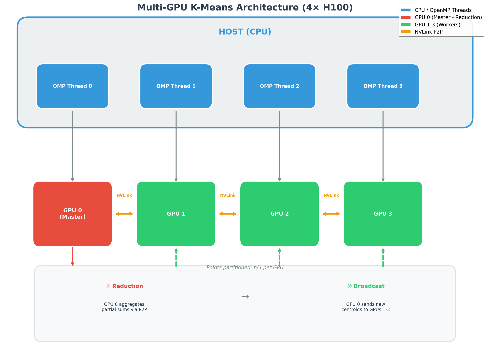
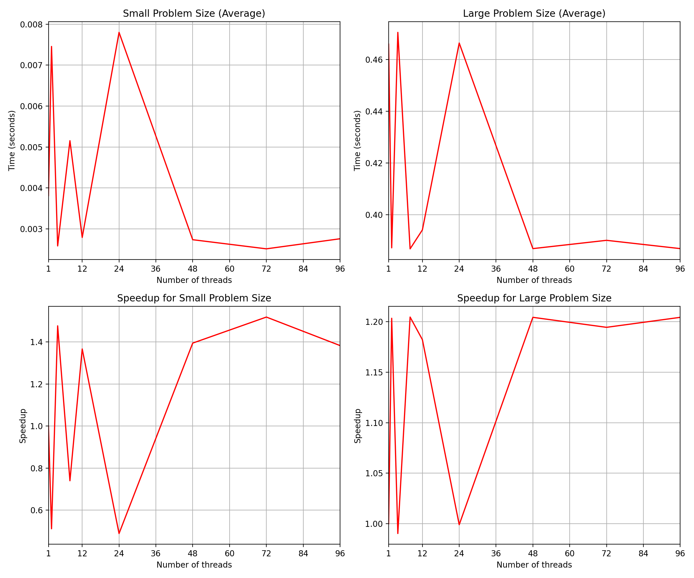
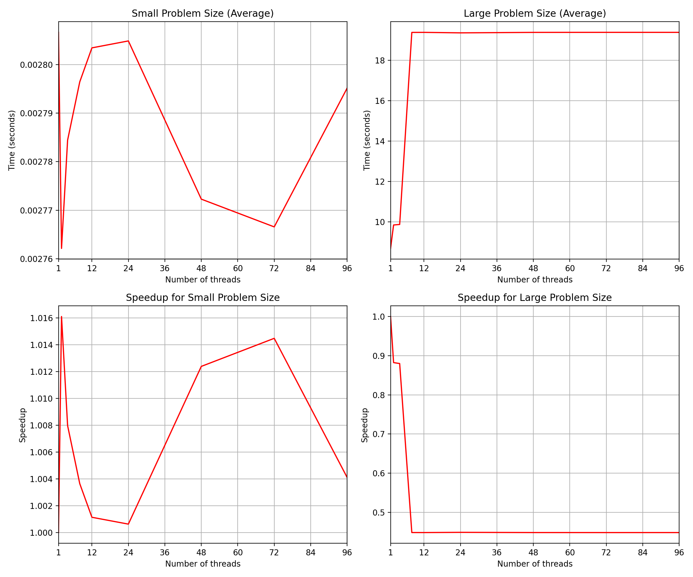

# K-Means Clustering - Multi-GPU CUDA Implementation

Multi-GPU implementation of K-means clustering using CUDA with P2P (peer-to-peer) communication via NVLink. Uses OpenMP threads to manage multiple GPUs in parallel.

## Overview



1. Allocate the data in parallel using cuda Allocation
2. Compute centroid assignments
3. Then Gather all partial sums from all devices
4. Send the partial sums to GPU 0 and compute the new positions.
5. Broadcast the data to GPUs and repeat the centroid assignments (step 2.)

## Performance (Large Dataset: 100M points, 50K centroids, 100 iterations)

| Implementation | GPUs | Time (s) 
|----------------|------|----------
| CUDA (Mini-Batches) | 1 | ~0.60 
| CUDA (Mini-Batches) | 4 | ~0.37 
| OpenMP (Mini-Batches) | 1 | ~0.60 
| OpenMP (Mini-Batches) | 4 | ~0.42  
| CUDA (Exact) | 4 | ~ 66 s

### Mini-Batch Mode


### Exact Mode (No Mini-Batches)


**Structure of Arrays (SoA)** for coalesced memory access


## Mini-Batch K-Means

| Mode | Condition | Points per Iteration | Use Cases |
|------|-----------|---------------------|----------|
| **Exact** | `n < 250,000` or `ENABLE_MINI_BATCH=false` | All points | Small datasets, verification |
| **Mini-Batch** | `n ≥ 250,000` and `ENABLE_MINI_BATCH=true` | 250,000 total (62.5K per GPU) | Large datasets, performance |

Uses a random subset of the points at each iteration 

### Random Sampling

Each iteration samples from a **random offset** in the data using `srand(1234)`:

```cpp
// Pre-computed before parallel region (rand() not thread-safe)
for (int d = 0; d < num_devices; ++d) {
    random_offsets[d] = rand() % devices[d].point_count;
}
```

## CUDA Functions Reference

### Memory Management

| Function | Description |
|----------|-------------|
| `cudaMalloc(&ptr, size)` | Allocates memory on GPU device (like `malloc` for GPU) |
| `cudaMallocHost(&ptr, size)` | Allocates **pinned memory** on host (see below) |
| `cudaFreeHost(ptr)` | Frees pinned host memory |

### Data Transfer

| Function | Description |
|----------|-------------|
| `cudaMemcpy(dst, src, size, direction)` | Synchronous copy between host↔device |
| `cudaMemcpyAsync(dst, src, size, dir, stream)` | Asynchronous copy (non-blocking, uses stream) |
| `cudaMemcpyPeerAsync(dst, dstDev, src, srcDev, size, stream)` | GPU-to-GPU copy via P2P/NVLink |
| `cudaMemsetAsync(ptr, value, size, stream)` | Asynchronously set memory to value (e.g., zero arrays) |

### Device & Stream Control

| Function | Description |
|----------|-------------|
| `cudaSetDevice(id)` | Select which GPU to use for subsequent calls |
| `cudaStreamCreate(&stream)` | Create an async execution stream |
| `cudaStreamSynchronize(stream)` | Block until all operations in stream complete |
| `cudaDeviceEnablePeerAccess(peer, flags)` | Enable direct GPU-to-GPU memory access (P2P) |

### Kernel Launch

```cpp
kernel<<<numBlocks, blockSize, sharedMem, stream>>>(args...);
```
- `numBlocks` - Number of thread blocks in the grid
- `blockSize` - Number of threads per block (e.g., 256)
- `sharedMem` - Shared memory size (0 if not used)
- `stream` - CUDA stream for async execution

## Pinned Memory

**Pinned (page-locked) memory** is host memory that cannot be swapped to disk by the OS.

```cpp
cudaMallocHost(&pinned_x, n * sizeof(double));  // Pinned
// vs
malloc(n * sizeof(double));                      // Regular (pageable)
```

The GPU's DMA can directly access pinned memory, enabling true overlap of computation and data transfer via CUDA streams.


## Compiler

| Implementation | Compiler 
|----------------|----------|
| CUDA | `nvcc` (NVIDIA CUDA Compiler) + `g++` host compiler 
| OpenMP | `nvc++` (NVIDIA HPC Compiler) 


| Flag | Description |
|------|-------------|
| `-std=c++14` | C++14 standard |
| `-arch=sm_90` | Target **H100 GPU** |
| `-O3` | |
| `-lgomp` | Link OpenMP runtime library |


